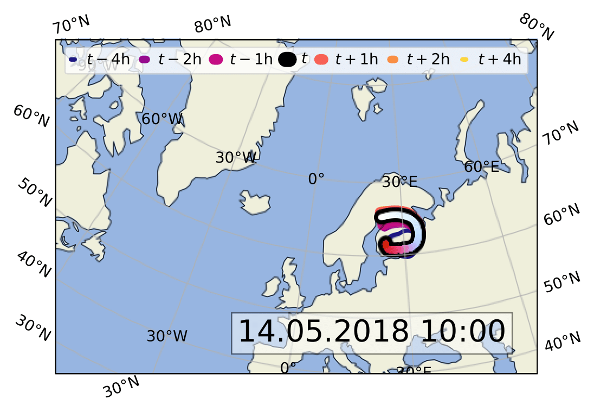
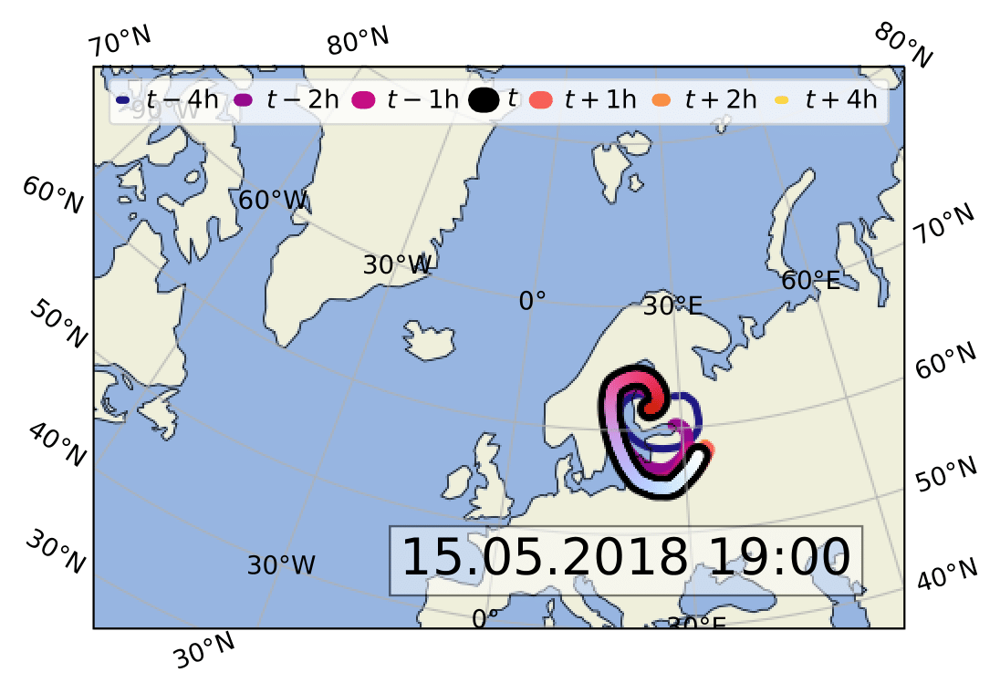
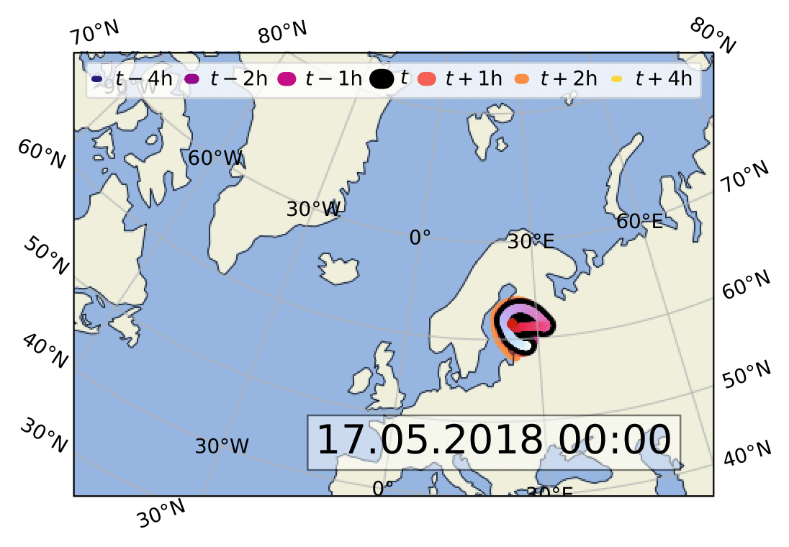
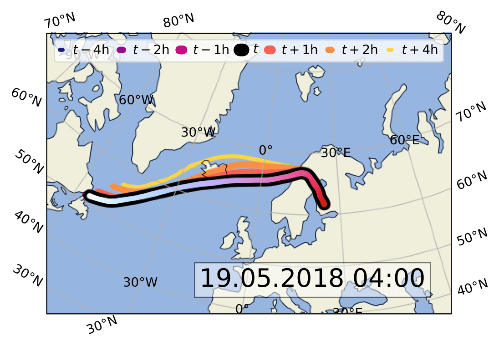
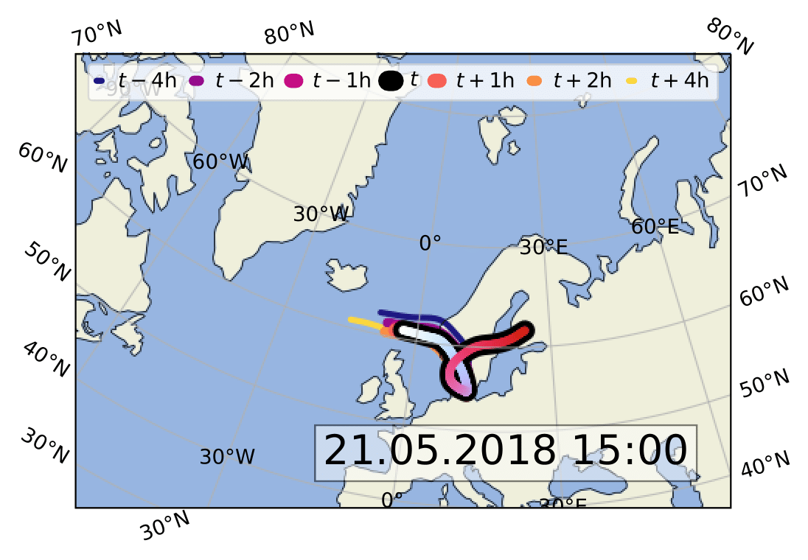
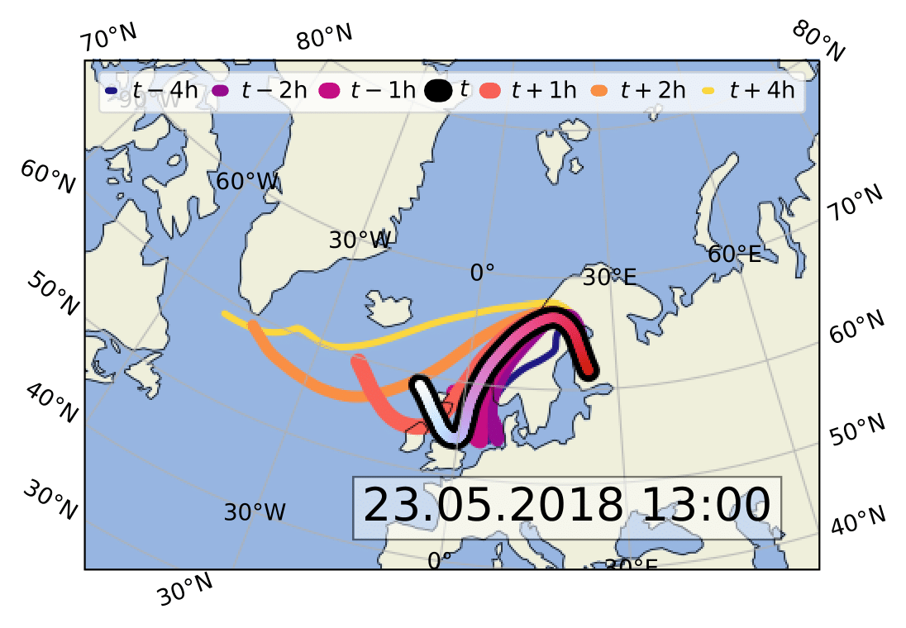

# The SOSAA Trajectories Dataset &emsp; [![License]][cc-zero-1.0]

[License]: https://img.shields.io/badge/License-CC0_1.0-black.svg
[cc-zero-1.0]: http://creativecommons.org/publicdomain/zero/1.0/

The SOSAA Trajectories Dataset includes the settings, inputs, and outputs of several trajectory runs of the [SOSAA model](https://www.helsinki.fi/en/researchgroups/multi-scale-modelling/sosaa).

The SOSAA model is a chemistry transport model that has been actively developed in the Multi-Scale Modelling Group at the University of Helsinki since 2011 [^1]. SOSAA was initially developed to run in stationary mode, in which it simulates the atmospheric processes near a measurement station. However, recent developments have focused on implementing a Lagrangian trajectory mode, in which emissions are picked up along the current mean meteorological trajectory that arrives at the station several days later.

This repository includes the SOSAA trajectories dataset. All runs in this dataset were performed with [SOSAA@10618aa](https://version.helsinki.fi/putian.zhou/sosaa/-/tree/10618aa98c7470546308adf132afb0bc0735b4eb). A snapshot of this now-outdated version can be accessed at [doi:10.5281/zenodo.7867026](https://doi.org/10.5281/zenodo.7867026). Unfortunately, the SOSAA model is not yet generally publicly available. However, access to the complete SOSAA source code is provided upon request -- please contact Michael Boy (michael.boy@helsinki.fi), Putian Zhou (putian.zhou@helsinki.fi), or Petri Clusius (petri.clusius@helsinki.fi) for more information.

The [first section](#description-of-the-dataset-layout-and-variables) of this README summarises the layout and variables of the dataset. Next, the [second section](#six-representative-trajectories) explores the six trajectories that are included. The [third section](#sosaa-input-perturbations) provides an overview of the SOSAA input perturbation runs that the dataset contains. Finally, the [fourth section](#list-of-sosaa-input-and-output-variables) gives a list of selected input and output variables in the dataset.

## Description of the Dataset Layout and Variables

The dataset is split into an extensive folder structure that contains the SOSAA configuration files and the input and output NetCDF files [^2] for each of the trajectories. Each trajectory is identified by the time at which it arrives at the SMEAR II measurement station at Hyytiälä, Finland [^3]. Both the top-level `inputs/` and `outputs/` folders are split into `baseline/` and `perturbation/` directories. The former contains the baseline SOSAA runs that are used in this chapter. The `perturbation/` directory is further split by perturbation group and kind, which are explained in the [third section](#sosaa-input-perturbations). These input directories are then split into `HYDE_BASE_Y2018/OUTPUT_bwd_YYYYMMDD` folders based on the arrival date of the trajectories. Each of these folders contains an `EMISSIONS_0422/` and a `METEO/` directory. For example, a trajectory that arrives on **21.05.2018** at **14:00 UTC** has the following four input files:

1. aerosol emissions input: `EMISSIONS_0422/20180521_7daybwd_Hyde_traj_AER_10_L3.nc`
2. anthropogenic emissions input: `EMISSIONS_0422/20180521_7daybwd_Hyde_traj_ANT_10_L3.nc`
3. biogenic emissions input: `EMISSIONS_0422/20180521_7daybwd_Hyde_traj_BIO_10_L3.nc`
4. meteorological conditions input: `METEO/METEO_20180521_R10.nc`

Note that instead of the arrival hour **14**, the input file names use the number of hours until midnight, **10** in this case. In contrast to the input directories, the output folders are directly split by the full arrival time and use the natural time format instead:

5. SOSAA output: `20180521_T14/output.nc`

Each input and output file stores variables that are indexed by time first and often by height layer second. Note that SOSAA can use arbitrary time and height resolutions. Please refer to the [fourth section](#list-of-sosaa-input-and-output-variables) for a complete list of the input variables.

## Six Representative Trajectories

This dataset includes six example trajectories, chosen from a large set of 480 SOSAA trajectory runs that cover the time period from 09.05.2018 at 00:00 UTC until 28.05.2018 at 23:00 UTC, with one trajectory arriving at every full hour. The six trajectories were chosen to cover different scenarios. The baseline and perturbation runs of these six trajectories and their temporal neighbours were then performed on the CSC Puhti supercomputer.

The [figures](#maps-for-the-six-example-trajectories) below show the paths that each of the six trajectories takes over the $\geq  5$ days before it arrives at Hyytiälä. While SOSAA simulates $\geq  7$ days of the trajectory, the initial 48-hour warm-up period is excluded from the analysis. The main trajectory has a black outline and is coloured from white at the start over blue and purple to red at the time of arrival in Hyytiälä. In addition to this main trajectory, six temporally adjacent trajectories are plotted with thinner lines. Specifically, for a trajectory at time $t$, the trajectories at times $t-4\text{h}$, $t-2\text{h}$, $t-1\text{h}$, $t+1\text{h}$, $t+2\text{h}$, and $t+4\text{h}$ are plotted in blue, purple, orange, and yellow. All temporally adjacent paths should roughly line if the meteorological conditions are stable. In contrast, the trajectory that arrived in Hyytiälä on 23.05.2018 at 13:00 UTC rapidly evolved over the next four hours. We briefly describe here the path that each of the six trajectories takes:

1. The first trajectory starts in Sweden and travels clockwise over Russia and the Gulf of Finland before arriving in Hyytiälä on **14.05.2018** at **10:00** UTC.
2. The second trajectory starts in Russia and travels counter-clockwise over the Baltics, then across to Sweden, and finally across the Gulf of Bothnia to Finland, where it arrives on **15.05.2018** at **19:00** UTC.
3. The third trajectory starts in Estonia and travels clockwise across the Gulf of Finland to the west of Finland before turning towards Russia, from where it heads to its arrival at Hyytiälä on **17.05.2018** at **00:00** UTC.
4. The fourth trajectory originates in eastern Canada, from where it crosses the Atlantic, over the southern coast of Iceland, before arriving in Norway, from where its path leads north-eastwards across Sweden and the Gulf of Bothnia to Finland, where it arrives on **19.05.2018** at **04:00** UTC.
5. The fifth trajectory starts north of Scotland, from where it travels eastwards to Norway. From Norway, it follows a clockwise bow-shape over southern Sweden and Denmark, before travelling north-eastwards towards Hyytiälä, where it arrives on **21.05.2018** at **15:00** UTC.
6. The sixth and final trajectory starts north-west of Scotland, from where it first travels southward over England, then sharply turns and travels northwards along the Norwegian coast before making yet another sharp turn to cross the Gulf of Bothnia from northern Sweden to southern Finland, where it arrives on **23.05.2018** at **13:00** UTC.

> ### Maps for the Six Example Trajectories
> | | |
> :-------------------------:|:-------------------------:
>  | 
>  | 
>  | 
> 
> Maps for the six example trajectories. Each map shows the time-coloured path of the trajectory that arrives at the listed time in Hyytiälä, as well as the paths of the prior and next trajectories.

## SOSAA Input Perturbations

We have classified most input variables as belonging to one of the following eight perturbation groups (see also the [fourth section](#list-of-sosaa-input-and-output-variables)):

1. **ant:** anthropogenic emissions, excluding $\text{CO}$, $\text{NO}_{x}$, $\text{NH}_3$, $\text{CH}_4$, and $\text{SO}_2$
2. **bio:** biogenic emissions, excluding $\text{CO}$, $\text{CH}_4$, $\text{CH}_2\text{Br}_2$, $\text{CH}_3\text{I}$, $\text{CHBr}_3$, $\text{DMS}$, and terpene emissions
3. **aer:** aerosol emissions with diameters between $3\text{nm}$ and $1000\text{nm}$
4. **mtp:** biogenic monoterpene emissions, including $\alpha$-pinene, $\beta$-pinene, and others
5. **sqt:** biogenic sesquiterpene emissions
6. **$\text{SO}_2$:** anthropogenic $\text{SO}_2$ emissions
7. **$\text{NO}_{x}$:** anthropogenic $\text{NO}_{x}$ emissions
8. **$T$:** air temperature

We assign each group a small increase, small decrease, large increase, and large decrease operation. For the emissions, these are the multiplicative factors $\times  1.01$, $\div  1.01$, $\times  1.5$, and $\div  1.5$, respectively. For the air temperature, we use $+1.04\text{K}$, $-1.04\text{K}$, $+2\text{K}$, and $-2\text{K}$. We have performed each of these 32 perturbation combinations for each of the six example trajectories (see the [second section](#six-representative-trajectories)) using the SOSAA model, which are also included in the SOSAA trajectories dataset.

## List of SOSAA Input and Output Variables

The following sections list the name, semantics, and units for each input and output variable in the SOSAA trajectories dataset that we use. The perturbation group for the [third section](#sosaa-input-perturbations) is also given in brackets after each variable's name. In each section, the first one or two variables describe the time and height layer indexing that is used by the following features, which all note how they are indexed.

### Meteorological Input Variables

1. `time`: time until the arrival at Hyytiälä in $\text{s}$
2. `lev`: height level in $\text{m}$
3. `t` (**temperature**): temperature in $\text{K}$, indexed by `time` and `lev`
4. `q` (***ungrouped***): specific humidity in $\frac{\text{kg}}{\text{kg}}$, indexed by `time` and `lev`
5. `ssr` (***ungrouped***): surface net solar radiation in $\frac{\text{W}}{\text{m}^2}$, indexed by `time`
6. `lsm` (***ungrouped***): land sea mask $(0-1)$, indexed by `time`
7. `blh` (***ungrouped***): atmospheric boundary layer height in $\text{m}$, indexed by `time`

### Aerosol Emission Input Variables

1. `layer`: elevation from the ground in $\text{m}$
2. `time`: time until the arrival at Hyytiälä in $\text{s}$
3. `3-10nm` (**aerosols**): $3-10\text{nm}$ diameter particle emissions in $\frac{\text{kg}}{\text{m}^2  \text{s}}$, indexed by `layer` and `time`
4. `10-20nm` (**aerosols**): $10-20\text{nm}$ diameter particle emissions in $\frac{\text{kg}}{\text{m}^2  \text{s}}$, indexed by `layer` and `time`
5. `20-30nm` (**aerosols**): $20-30\text{nm}$ diameter particle emissions in $\frac{\text{kg}}{\text{m}^2  \text{s}}$, indexed by `layer` and `time`
6. `30-50nm` (**aerosols**): $30-50\text{nm}$ diameter particle emissions in $\frac{\text{kg}}{\text{m}^2  \text{s}}$, indexed by `layer` and `time`
7. `50-70nm` (**aerosols**): $50-70\text{nm}$ diameter particle emissions in $\frac{\text{kg}}{\text{m}^2  \text{s}}$, indexed by `layer` and `time`
8. `70-100nm` (**aerosols**): $70-100\text{nm}$ diameter particle emissions in $\frac{\text{kg}}{\text{m}^2  \text{s}}$, indexed by `layer` and `time`
9. `100-200nm` (**aerosols**): $100-200\text{nm}$ diameter particle emissions in $\frac{\text{kg}}{\text{m}^2  \text{s}}$, indexed by `layer` and `time`
10. `200-400nm` (**aerosols**): $200-400\text{nm}$ diameter particle emissions in $\frac{\text{kg}}{\text{m}^2  \text{s}}$, indexed by `layer` and `time`
11. `400-1000nm` (**aerosols**): $400-1000\text{nm}$ diameter particle emissions in $\frac{\text{kg}}{\text{m}^2  \text{s}}$, indexed by `layer` and `time`

### Anthropogenic Emission Input Variables

1. `layer`: elevation from the ground in $\text{m}$
2. `time`: time until the arrival at Hyytiälä in $\text{s}$
3. `co` (***ungrouped***): $\text{CO}$ emissions in $\frac{\text{kg}}{\text{m}^2  \text{s}}$, indexed by `layer` and `time`
4. `nox` (**$\text{NO}_{x}$**): $\text{NO}_{x}$ emissions in $\frac{\text{kg}}{\text{m}^2  \text{s}}$, indexed by `layer` and `time`
5. `co2` (**anthropogenic**): $\text{CO}_{2}$ emissions in $\frac{\text{kg}}{\text{m}^2  \text{s}}$, indexed by `layer` and `time`
6. `nh3` (***ungrouped***): $\text{NH}_{3}$ emissions in $\frac{\text{kg}}{\text{m}^2  \text{s}}$, indexed by `layer` and `time`
7. `ch4` (***ungrouped***): $\text{CH}_{4}$ emissions in $\frac{\text{kg}}{\text{m}^2  \text{s}}$, indexed by `layer` and `time`
8. `so2` (**$\text{SO}_{2}$**): $\text{SO}_{2}$ emissions in $\frac{\text{kg}}{\text{m}^2  \text{s}}$, indexed by `layer` and `time`
9. `nmvoc` (**anthropogenic**): non-methane VOC emissions in $\frac{\text{kg}}{\text{m}^2  \text{s}}$, indexed by `layer` and `time`
10. `alcohols` (**anthropogenic**): alcohol emissions in $\frac{\text{kg}}{\text{m}^2  \text{s}}$, indexed by `layer` and `time`
11. `ethane` (**anthropogenic**): ethane emissions in $\frac{\text{kg}}{\text{m}^2  \text{s}}$, indexed by `layer` and `time`
12. `propane` (**anthropogenic**): propane emissions in $\frac{\text{kg}}{\text{m}^2  \text{s}}$, indexed by `layer` and `time`
13. `butanes` (**anthropogenic**): emissions of butanes in $\frac{\text{kg}}{\text{m}^2  \text{s}}$, indexed by `layer` and `time`
14. `pentanes` (**anthropogenic**): emissions of pentanes in $\frac{\text{kg}}{\text{m}^2  \text{s}}$, indexed by `layer` and `time`
15. `hexanes` (**anthropogenic**): emissions of hexanes in $\frac{\text{kg}}{\text{m}^2  \text{s}}$, indexed by `layer` and `time`
16. `ethene` (**anthropogenic**): ethene emissions in $\frac{\text{kg}}{\text{m}^2  \text{s}}$, indexed by `layer` and `time`
17. `propene` (**anthropogenic**): propene emissions in $\frac{\text{kg}}{\text{m}^2  \text{s}}$, indexed by `layer` and `time`
18. `acetylene` (**anthropogenic**): acetylene emissions in $\frac{\text{kg}}{\text{m}^2  \text{s}}$, indexed by `layer` and `time`
19. `isoprene` (**anthropogenic**): isoprene emissions in $\frac{\text{kg}}{\text{m}^2  \text{s}}$, indexed by `layer` and `time`
20. `monoterpenes` (**anthropogenic**): emissions of monoterpenes in $\frac{\text{kg}}{\text{m}^2  \text{s}}$, indexed by `layer` and `time`
21. `other-alkenes-and-alkynes` (**anthropogenic**): emissions of other alkenes and alkynes in $\frac{\text{kg}}{\text{m}^2  \text{s}}$, indexed by `layer` and `time`
22. `benzene` (**anthropogenic**): benzene emissions in $\frac{\text{kg}}{\text{m}^2  \text{s}}$, indexed by `layer` and `time`
23. `toluene` (**anthropogenic**): toluene emissions in $\frac{\text{kg}}{\text{m}^2  \text{s}}$, indexed by `layer` and `time`
24. `xylene` (**anthropogenic**): xylene emissions in $\frac{\text{kg}}{\text{m}^2  \text{s}}$, indexed by `layer` and `time`
25. `trimethylbenzene` (**anthropogenic**): trimethylbenzene emissions in $\frac{\text{kg}}{\text{m}^2  \text{s}}$, indexed by `layer` and `time`
26. `other-aromatics` (**anthropogenic**): emissions of other aromatics in $\frac{\text{kg}}{\text{m}^2  \text{s}}$, indexed by `layer` and `time`
27. `esters` (**anthropogenic**): emissions of esters in $\frac{\text{kg}}{\text{m}^2  \text{s}}$, indexed by `layer` and `time`
28. `ethers` (**anthropogenic**): emissions of ethers in $\frac{\text{kg}}{\text{m}^2  \text{s}}$, indexed by `layer` and `time`
29. `formaldehyde` (**anthropogenic**): formaldehyde emissions in $\frac{\text{kg}}{\text{m}^2  \text{s}}$, indexed by `layer` and `time`
30. `other-aldehydes` (**anthropogenic**): emissions of other aldehydes in $\frac{\text{kg}}{\text{m}^2  \text{s}}$, indexed by `layer` and `time`
31. `total-ketones` (**anthropogenic**): total ketones emissions in $\frac{\text{kg}}{\text{m}^2  \text{s}}$, indexed by `layer` and `time`
32. `total-acids` (**anthropogenic**): total acids emissions in $\frac{\text{kg}}{\text{m}^2  \text{s}}$, indexed by `layer` and `time`
33. `other-VOCs` (**anthropogenic**): emissions of other VOCs in $\frac{\text{kg}}{\text{m}^2  \text{s}}$, indexed by `layer` and `time`

### Biogenic Emission Input Variables

1. `time`: time until the arrival at Hyytiälä in $\text{s}$
2. `acetaldehyde` (**biogenic**): acetaldehyde emissions in $\frac{\text{kg}}{\text{m}^2  \text{s}}$, indexed by `time`
3. `acetone` (**biogenic**): acetone emissions in $\frac{\text{kg}}{\text{m}^2  \text{s}}$, indexed by `time`
4. `butanes-and-higher-alkanes` (**biogenic**): emissions of butanes and higher alkanes in $\frac{\text{kg}}{\text{m}^2  \text{s}}$, indexed by `time`
5. `butenes-and-higher-alkenes` (**biogenic**): emissions of butenes and higher alkenes in $\frac{\text{kg}}{\text{m}^2  \text{s}}$, indexed by `time`
6. `CH4` (***ungrouped***): $\text{CH}_{4}$ emissions in $\frac{\text{kg}}{\text{m}^2  \text{s}}$, indexed by `time`
7. `CO` (***ungrouped***): $\text{CO}$ emissions in $\frac{\text{kg}}{\text{m}^2  \text{s}}$, indexed by `time`
8. `ethane` (**biogenic**): ethane emissions in $\frac{\text{kg}}{\text{m}^2  \text{s}}$, indexed by `time`
9. `ethanol` (**biogenic**): ethanol emissions in $\frac{\text{kg}}{\text{m}^2  \text{s}}$, indexed by `time`
10. `ethene` (**biogenic**): ethene emissions in $\frac{\text{kg}}{\text{m}^2  \text{s}}$, indexed by `time`
11. `formaldehyde` (**biogenic**): formaldehyde emissions in $\frac{\text{kg}}{\text{m}^2  \text{s}}$, indexed by `time`
12. `hydrogen-cyanide` (**biogenic**): hydrogen-cyanide emissions in $\frac{\text{kg}}{\text{m}^2  \text{s}}$, indexed by `time`
13. `isoprene` (**biogenic**): isoprene emissions in $\frac{\text{kg}}{\text{m}^2  \text{s}}$, indexed by `time`
14. `MBO` (**biogenic**): 2-Methyl-3-buten-2-ol (MBO) emissions in $\frac{\text{kg}}{\text{m}^2  \text{s}}$, indexed by `time`
15. `methanol` (**biogenic**): methanol emissions in $\frac{\text{kg}}{\text{m}^2  \text{s}}$, indexed by `time`
16. `methyl-bromide` (**biogenic**): methyl-bromide emissions in $\frac{\text{kg}}{\text{m}^2  \text{s}}$, indexed by `time`
17. `methyl-chloride` (**biogenic**): methyl-chloride emissions in $\frac{\text{kg}}{\text{m}^2  \text{s}}$, indexed by `time`
18. `methyl-iodide` (**biogenic**): methyl-iodide emissions in $\frac{\text{kg}}{\text{m}^2  \text{s}}$, indexed by `time`
19. `other-aldehydes` (**biogenic**): emissions of other aldehydes in $\frac{\text{kg}}{\text{m}^2  \text{s}}$, indexed by `time`
20. `other-ketones` (**biogenic**): emissions of other ketones in $\frac{\text{kg}}{\text{m}^2  \text{s}}$, indexed by `time`
21. `other-monoterpenes` (**monoterpenes**): emissions of other monoterpenes in $\frac{\text{kg}}{\text{m}^2  \text{s}}$, indexed by `time`
22. `pinene-a` (**monoterpenes**): $\alpha$-pinene emissions in $\frac{\text{kg}}{\text{m}^2  \text{s}}$, indexed by `time`
23. `pinene-b` (**monoterpenes**): $\beta$-pinene emissions in $\frac{\text{kg}}{\text{m}^2  \text{s}}$, indexed by `time`
24. `propane` (**biogenic**): propane emissions in $\frac{\text{kg}}{\text{m}^2  \text{s}}$, indexed by `time`
25. `propene` (**biogenic**): propene emissions in $\frac{\text{kg}}{\text{m}^2  \text{s}}$, indexed by `time`
26. `sesquiterpenes` (**sesquiterpenes**): emissions of sesquiterpenes in $\frac{\text{kg}}{\text{m}^2  \text{s}}$, indexed by `time`
27. `toluene` (**biogenic**): toluene emissions in $\frac{\text{kg}}{\text{m}^2  \text{s}}$, indexed by `time`
28. `CH2Br2` (***ungrouped***): $\text{CH}_{2}\text{Br}_{2}$ emissions in $\frac{\text{kg}}{\text{m}^2  \text{s}}$, indexed by `time`
29. `CH3I` (***ungrouped***): $\text{CH}_{3}\text{I}$ emissions in $\frac{\text{kg}}{\text{m}^2  \text{s}}$, indexed by `time`
30. `CHBr3` (***ungrouped***): $\text{CHBr}_{3}$ emissions in $\frac{\text{kg}}{\text{m}^2  \text{s}}$, indexed by `time`
31. `DMS` (***ungrouped***): dimethylsulfide (DMS) emissions in $\frac{\text{kg}}{\text{m}^2  \text{s}}$, indexed by `time`

### Selected Output Variables

1. `time`: time since the beginning of the month in $\text{s}$
2. `dp_dry_fs`: dry radius in $\text{m}$ of aerosol particles in each size bin
3. `lev`: height above the ground in $\text{m}$
4. `nconc_par`: particle number concentration in $\frac{1}{\text{m}^3}$, indexed by `time`, `dp_dry_fs`, and `lev`

## License

Licensed under the CC0 1.0 license ([LICENSE](LICENSE) or https://creativecommons.org/publicdomain/zero/1.0/).

## Citation

Please refer to the [CITATION.cff](CITATION.cff) file and refer to https://citation-file-format.github.io to extract the citation in a format of your choice.

This dataset was created as part of [Juniper Tyree](https://github.com/juntyr)'s Masters Thesis ["Prudent Response Surface Models"](https://github.com/juntyr/prudent-response-surface-models) for the M.Sc. Theoretical and Computational Methods programme at the University of Helsinki.

[^1]: M. Boy *et al*. SOSA &ndash; a new model to simulate the concentrations of organic vapours and sulphuric acid inside the ABL &ndash; Part 1: Model description and initial evaluation. *Atmospheric Chemistry and Physics*. 2011;11 (1): 43&ndash;51. Available from: [doi:10.5194/acp-11-43-2011](https://doi.org/10.5194/acp-11-43-2011).

[^2]: R. Rew *et al*. Unidata NetCDF. 1989. Available from: [doi:10.5065/D6H70CW6](https://doi.org/10.5065/D6H70CW6).

[^3]: P. Hari *et al*. Station for Measuring Ecosystem-Atmosphere Relations: SMEAR. *Physical and Physiological Forest Ecology*. Edited by P. Hari, K. Heliövaara and L. Kulmala. Dordrecht: Springer Netherlands, 2013, 471&ndash;487. Available from: [doi:10.1007/978-94-007-5603-8_9](https://doi.org/10.1007/978-94-007-5603-8_9).
